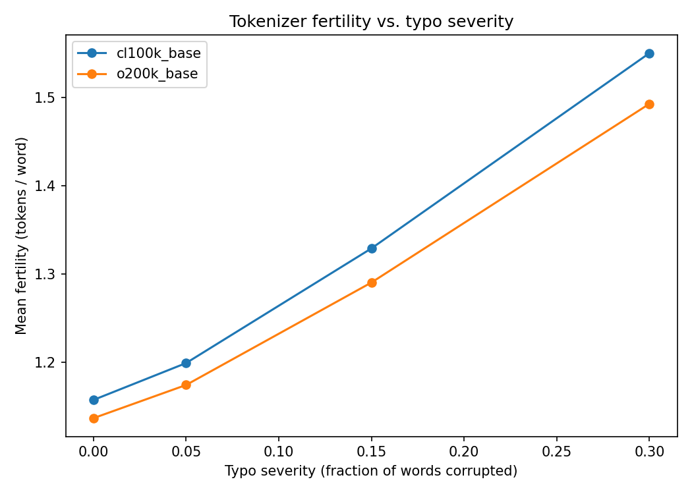

# mis-token

*Autocorrect and I have never seen eye to eye. Here's what that's costing me in tokens.*

Does misspelling your LLM prompts actually cost you more tokens?

**Origin story:** I am a recovering BlackBerry user. I had a physical
keyboard with actual, individual, tactile keys, and I was *good* at it. Then
the world moved on to glass slabs, and now every prompt I fire off in a
hurry looks like it went through a blender — "waht are the odds" this,
"cna you help me" that. Talk-to-text was supposed to save me, but Siri and
I have a strained relationship at best; half the time it hears a grocery
list when I'm asking about gradient descent.

My working theory has always been "eh, the model's smart, it'll figure out
what I meant." Which, fine, it usually does. But then I started wondering:
is that forgiveness actually *free*? Or am I quietly paying a toll every
time autocorrect and I fail to agree on the word "definitely"? This repo is
me finding out.

There's solid research on typos hurting **accuracy** (see [Background](#background)
below), but surprisingly little that isolates the **tokenization/cost** side:
misspelled words often get split differently — and less efficiently — by a
BPE tokenizer than their correct forms, but nobody seems to have put a clean
number on it. So: for the sake of every thumb that has ever missed the "e"
key and hit "r" instead, let's measure it.

## What it does

1. **Injects realistic typos** into a set of seed prompts at controlled
   severity levels (0%, 5%, 15%, 30% of words), using weighted edit types
   (substitution, insertion, deletion, transposition) and a QWERTY-adjacency
   map, so errors look like real fat-finger mistakes rather than random noise.
2. **Tokenizes** clean and corrupted versions with multiple tokenizers
   (`cl100k_base`, `o200k_base`, and optionally any Hugging Face tokenizer).
3. **Compares** token count, fertility (tokens/word), and % increase vs. the
   clean baseline, and plots fertility against typo severity.

## Why these severity levels

5%, 15%, and 30% aren't arbitrary — they roughly span the real-world range
of typo rates reported in the literature: token-level error rates around
11% in noisy health-search queries, up to 5–17% in hastily-written clinical
text, and roughly 1-in-8 prompts containing at least one typo in a corpus of
real programmer prompts to LLMs. Anecdotally, 30% feels about right for me
on a moving train with 8% battery left, so I'm calling that "empirically
validated" too.

## A confession about scope

This project only tests *typed* typos — the keyboard-fumble kind. It does
not (yet) cover talk-to-text garbage, which is arguably the more chaotic
failure mode: instead of "teh" for "the," you get Siri confidently inserting
an entire unrelated proper noun because it misheard you over a car engine.
That's a fundamentally different error distribution (phonetic confusion, not
key-adjacency), and probably deserves its own repo. I'd also genuinely like
to know what fraction of people prompt by voice vs. by typing — my prior is
that most people type on the UI and voice input is a minority sport, but if
you've seen real numbers on that split, open an issue.

## Quickstart

```bash
git clone https://github.com/<you>/mis-token
cd mis-token
pip install -r requirements.txt

cd src
python tokenize_compare.py --input ../data/prompts.txt --out ../results/token_counts.csv
python analyze.py --input ../results/token_counts.csv
```

To include a Hugging Face tokenizer (e.g. Llama 3) alongside the OpenAI ones:

```bash
python tokenize_compare.py --tokenizers cl100k_base o200k_base meta-llama/Llama-3.1-8B
```

Run tests:

```bash
python test_typo_injector.py
```

## Results

*(fill in after running — this is the payoff section)*

| Tokenizer | Severity | Mean fertility (tok/word) | % increase vs. clean |
|---|---|---|---|
| cl100k_base | 0% | — | — |
| cl100k_base | 15% | — | — |
| cl100k_base | 30% | — | — |



## Background

Typos have a well-documented effect on LLM **accuracy**:

- Spelling errors have the most severe effect on machine-translation quality
  compared to other prompt imperfections, more than disfluencies or
  simplifications, and the damage compounds when error types combine
  ([How Important is 'Perfect' English for MT Prompts?](https://arxiv.org/pdf/2507.09509)).
- Even reasoning models aren't immune — GPT-5-thinking-nano's MMLU accuracy
  dropped from 91.26% to 86.45% with typos in just 5% of prompt words, even
  though its own reasoning traces often noticed the typo
  ([sparse-autoencoder OOD paper](https://arxiv.org/pdf/2606.26396)).
- A single-character misspelling of a valid library name caused GPT-5-mini
  to hallucinate/misuse the wrong library in 26% of coding tasks
  ([Library Hallucinations paper](https://arxiv.org/pdf/2509.22202)).

What's much less studied is the **token/cost** side — the fact that a
misspelled word can tokenize into more, smaller pieces than its correct
form, inflating input length for the exact same intent. That's the gap this
project measures directly.

## Repo layout

```
src/
  typo_injector.py       # core typo injection logic + CLI demo
  tokenize_compare.py     # runs the severity sweep across tokenizers
  analyze.py               # summary stats + chart
  test_typo_injector.py    # unit tests
data/
  prompts.txt               # seed prompts (edit/extend freely)
results/                    # generated CSVs + chart land here
```

## Ideas for extending this

- Swap in **natural** typos (e.g. from a keystroke-log or query-log corpus)
  instead of synthetic ones, and see if the fertility effect holds.
- Measure actual **API latency and output length**, not just input token
  count — a typo'd prompt might also provoke longer clarifying/corrective
  responses.
- Break down the effect by **word length** or **word frequency** — are rare
  words disproportionately hit because they're already near a tokenizer's
  fragmentation boundary?
- Compare a byte-level tokenizer to a BPE tokenizer directly, since
  byte-level models are believed to be more typo-resilient by construction.
- Model talk-to-text errors as their own severity axis (phonetic
  substitution instead of key-adjacency substitution) and see whether
  Siri-typos are more or less costly than thumb-typos. Working title:
  "Revenge of the BlackBerry."

## In memoriam

To the physical keyboard: you were faster, you were tactile, you never once
tried to autocorrect "SQL" to "SQL'd," and you are missed.

## License

MIT
